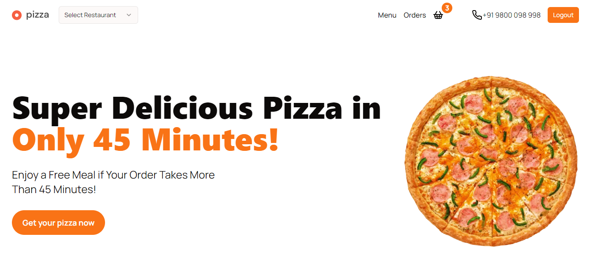

# Frontend Project

Welcome to my Pizza Ordering Website.

## Project



## Technologies Used

List the technologies and tools i've used in your project.

- NEXT JS
- SHADCN FOR STYLING

## Getting Started

First, run the development server:

```bash
- npm run dev
- project will start running.

```

Open [http://localhost:3000](http://localhost:3000) with your browser to see the result.

You can start editing the page by modifying `app/page.tsx`. The page auto-updates as you edit the file.


## Learn More

To learn more about Next.js, take a look at the following resources:

- [Next.js Documentation](https://nextjs.org/docs) - learn about Next.js features and API.
- [Learn Next.js](https://nextjs.org/learn) - an interactive Next.js tutorial.

You can check out [the Next.js GitHub repository](https://github.com/vercel/next.js/) - your feedback and contributions are welcome!
Check out our [Next.js deployment documentation](https://nextjs.org/docs/deployment) for more details.

## Contributing

If you would like to contribute, feel free to submit issues or pull requests. I appreciate any feedback or collaboration!
